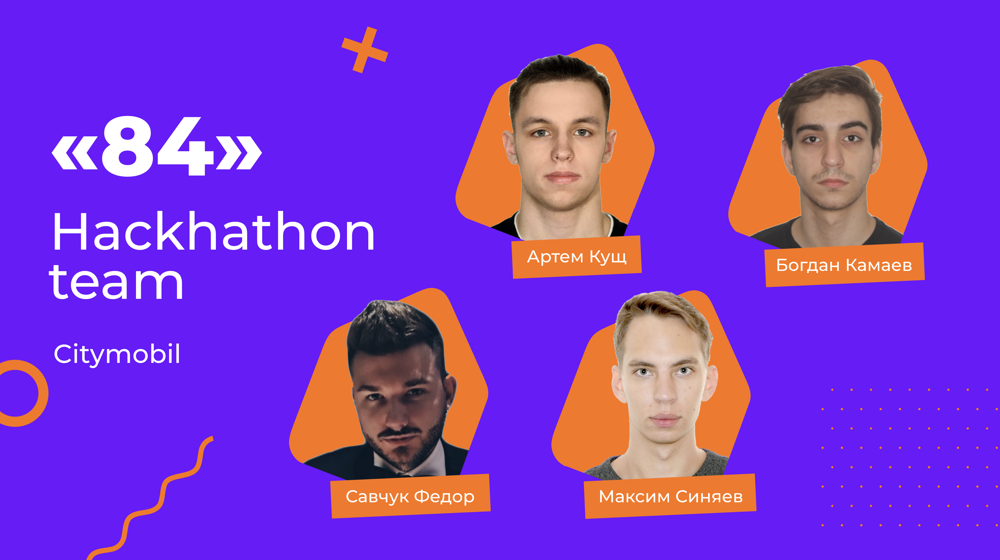
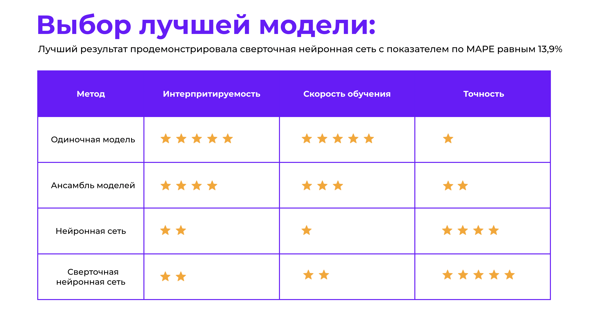
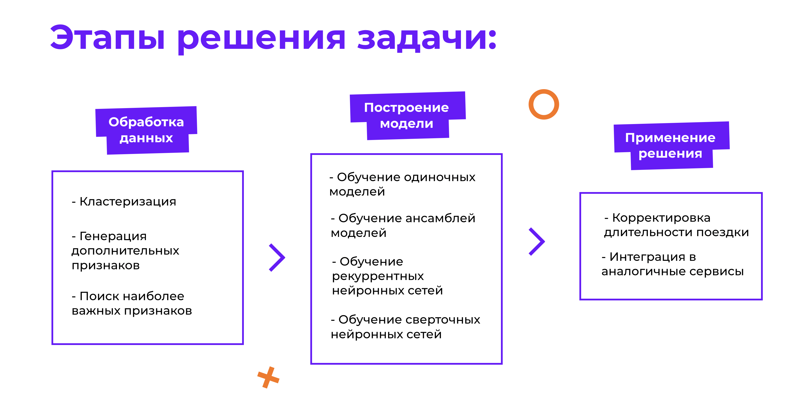
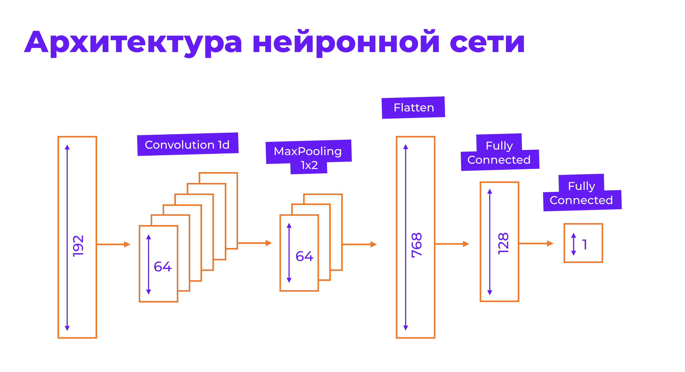

# MIPT Hackaton CityMobil DataScience track
This hack also had a [kaggle competition](https://www.kaggle.com/c/final-etarta). My team took 6th place, unfortunatly with 14.39% MAPE on best submission.

